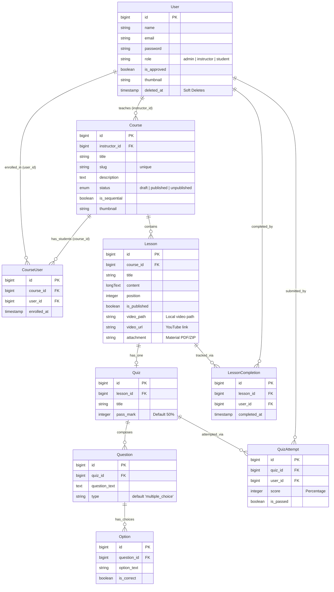

# LMS Pro - System Capabilities & Architecture

Welcome to **LMS Pro**, a premium, feature-rich Learning Management System built on the modern **Laravel 12** framework. The platform provides a seamless, roles-based digital academy environment for administrators, instructors, and students.

---

## 🏗️ Architecture & Tech Stack

- **Backend Framework**: [Laravel 12](https://laravel.com) (PHP 8.2+)
- **Frontend / Styling**: [Tailwind CSS](https://tailwindcss.com) with premium custom-designed themes (light/dark mode toggle utilizing CSS custom properties for glassmorphic and high-fidelity aesthetics)
- **Frontend Logic**: [Alpine.js](https://alpinejs.dev) (for interactive components) & Vite bundler
- **Authentication**: [Laravel Breeze](https://laravel.com/docs/11.x/starter-kits#laravel-breeze) (complete authentication scaffolding)
- **Database**: SQL-compliant (supporting MySQL / PostgreSQL / SQLite) with Laravel Eloquent ORM

---

## 📊 Database Relationships (Entity-Relationship Diagram)

---

## 🔑 Role-Based Capabilities

The system partitions functionality into three roles, each protected by custom middlewares (`AdminMiddleware` and `InstructorApprovedMiddleware`).

### 1. 🛡️ Administrator (Admin)
The administrative dashboard acts as the governing body of the academy.
- **Platform Analytics**: Instantly monitor total enrolled students, total active instructors, published courses, and pending applications.
- **Instructor Verification Queue**: Approve, reject, or delete instructor applications. Instructors cannot access course creation tools until approved.
- **Instructor Offboarding & Termination**:
  - In a secure database transaction, an admin can terminate an active instructor.
  - This automatically unpublishes all of their courses, hard-deletes student enrollments for these courses, and soft-deletes the instructor user to maintain data integrity.

### 2. 👨‍🏫 Instructor
Instructors are content authors with dedicated resources.
- **Performance Analytics**: 
  - Track total created courses (published vs. draft), unique student counts across all courses, and real-time quiz metrics (total attempts, pass rates, and average scores per course).
  - Review recent student enrollments (last 7 days).
- **Course Studio**:
  - Create and update course profiles, upload custom card thumbnails, write rich descriptions, and toggle the **Sequential Progression Mode**.
  - Control course status: `draft` (hidden), `published` (live), or `unpublished` (archived).
- **Lesson Management**:
  - Manage lesson modules inside each course with custom sort ordering (`position` field).
  - Upload raw video files directly (up to 50MB, stored on local disk) or embed YouTube lectures (automatically parses standard video URLs into embed format).
  - Attach downloadable study documents (PDFs, PPTs, ZIPs up to 20MB).
- **Quiz Architect**:
  - Attach multiple-choice quizzes to any lesson.
  - Set a custom passing grade (e.g., 80% passing threshold).
  - Add/delete questions and their corresponding multiple-choice options with a single click.
  - **Dynamic Invalidation**: Adding or modifying a quiz automatically deletes prior lesson completions for that lesson, requiring students to pass the new assessment to regain complete status.

### 3. 🎓 Student
Students are learners engaged in self-paced or structured study.
- **My Learning Center**:
  - View overall learning stats (total enrolled courses, average progression percentage, completed courses, and quizzes passed).
  - Monitor recent lesson completions and a list of upcoming uncompleted quizzes.
- **Course Catalog**:
  - Browse all active published courses from verified instructors.
  - View full course structures, syllabi, and details.
  - Enroll or unenroll from courses (unenrolling performs a database transaction to wipe progress metrics and completions for that course).
- **Lesson Player & Learning Progression**:
  - Access an interactive lesson player with video streaming (local or embedded), text reading, and attachment downloads.
  - **Sequential Learning Mode**: If a course is sequential, students are prohibited from skipping ahead. The system validates completions; skipping redirects the student to their first incomplete lesson with a reminder.
- **Interactive Assessments**:
  - Take quizzes directly in the lesson pane.
  - Receive instant feedback on attempts. If the student passes, the lesson is automatically marked as completed, unlocking the next step.

---

## 🎨 Premium UI Features & Design Tokens
- **Theme-Aware Custom Variable System**: Uses a global CSS variable registry supporting standard light mode and a glassmorphic dark mode (`html.dark`).
- **Smooth transitions & micro-animations**: Layout transitions and hover animations on cards, nav links, and theme togglers.
- **Ambient Glows**: Ambient glowing circles (`.glow-tl`, `.glow-br`) that shift color dynamically with the theme setting to give a high-end feel.
- **Fully Responsive**: Scalable templates optimized for mobile viewports, tablets, and desktop displays.
